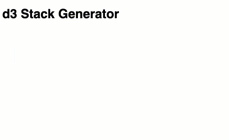
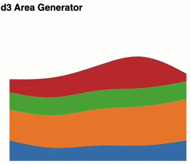
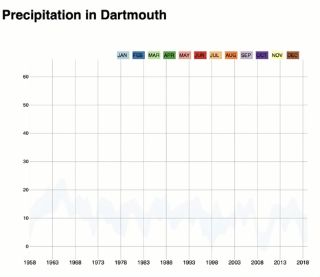

# D3 Generators

<h2>Generators:</h2>
- <a href="http://using-d3js.com/05_02_lines.html">d3.line()</a> & <a href="http://using-d3js.com/05_03_radial_lines.html">d3.lineRadial</a>
- <a href="http://using-d3js.com/05_05_areas.html">d3.area() & d3.areaRadial()</a>
- <a href="http://using-d3js.com/05_06_stacks.html">d3.stack()</a> & 

## Examples

| Example | Topic | Open | Notes |
| --- | --- | --- | --- |
| 1 | Stacked bar chart | [HTML](./Example%201/index.html) | [README](./Example%201/README.md) |
| 2 | Stacked area chart | [HTML](./Example%202/index.html) | [README](./Example%202/README.md) |
| 3 | Dartmouth precipitation area chart | [HTML](./Example%203/index.html) | [README](./Example%203/README.md) |
| 4 | Dartmouth streamgraph | [HTML](./Example%204/index.html) | [README](./Example%204/README.MD) |
| 5 | Dartmouth streamgraph (same chart as Example 4) | [HTML](./Example%205/index.html) | [README](./Example%205/README.MD) |
| 6 | Massachusetts station streamgraph | [HTML](./Example%206/index.html) | — |
| Table generator | CSV to HTML table | [HTML](./tableGenerator/index.html) | — |

## Previews

Stacked bar chart:

Stacked area chart:

Streamgraph:

