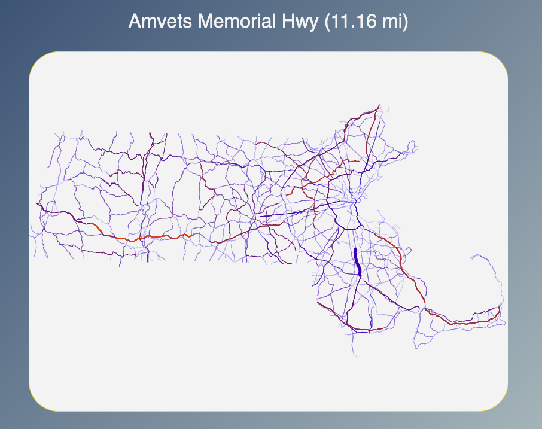
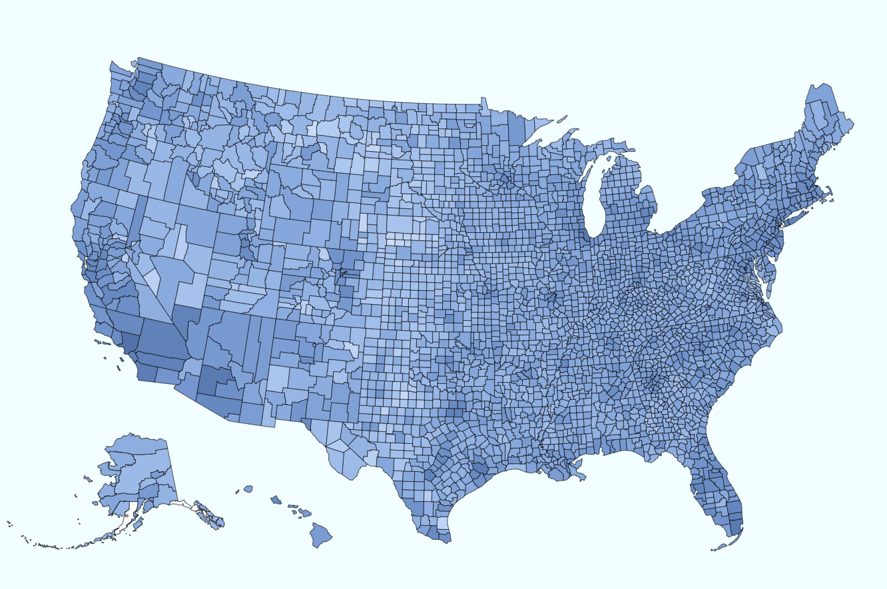
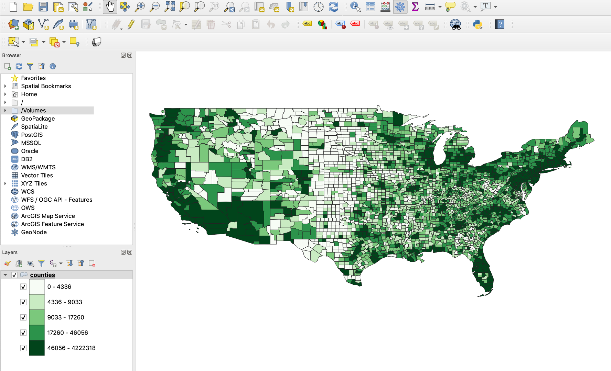
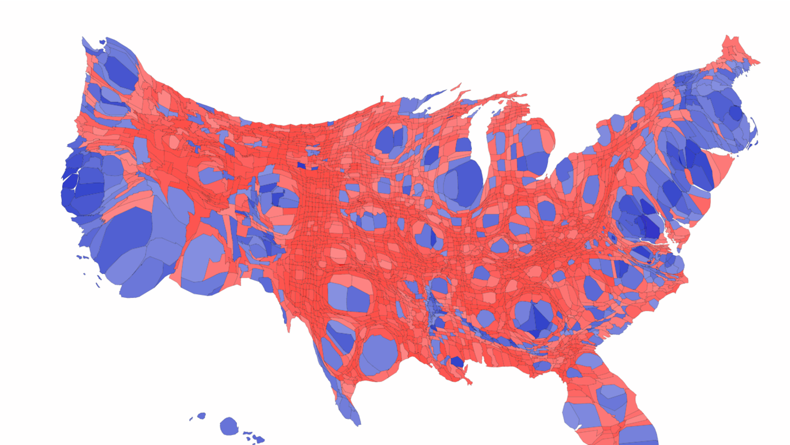
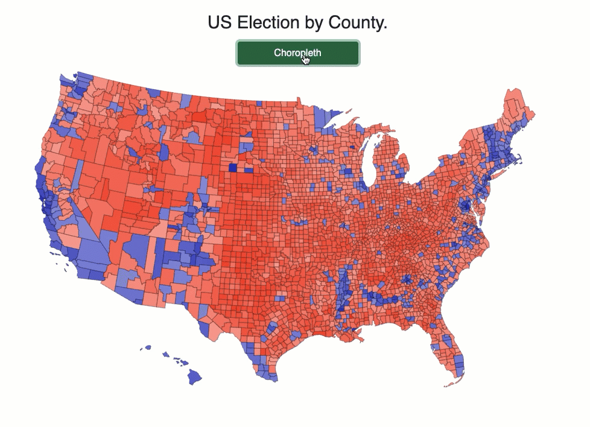
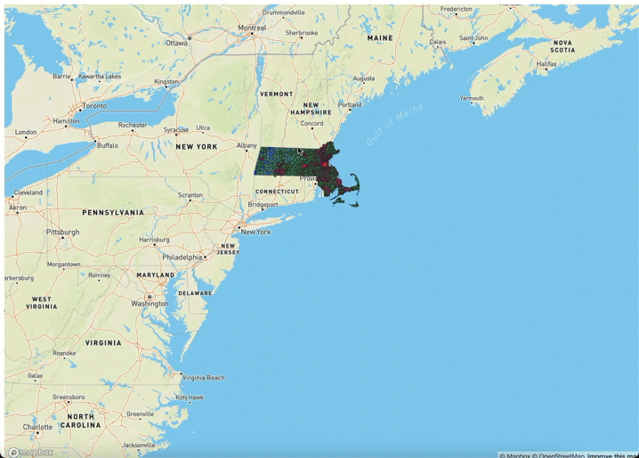

git # Week 6: Geospatial Visualization

A collection of data visualization examples using D3.js, Deck.gl, and Mapbox for creating interactive geospatial visualizations.

## Setup

To run these examples:
1. Open any HTML file in a modern web browser (Chrome, Firefox, Safari, Edge)
2. No build process or server required for most examples
3. Some examples that load external data may require a local server to avoid CORS issues

## Part 1: Geospatial Data with D3JS

Learn how to load and visualize geographic data formats (GeoJSON, TopoJSON, Shapefile).

### 1.1 Line Visualization 

Demonstrates drawing geographic line features using D3.js projections.

### 1.2 Loading TopoJSON and GeoJSON

Learn how to load and parse different geographic data formats in D3.js.

### 1.3 Choropleth Map

Create a choropleth map that colors regions based on data values using D3.js.

### 1.4 Data Processing

Examples of data processing and format conversion using GeoPandas.

## Part 2: Cartogram Maps

Create distorted geographic maps where area is proportional to a data variable.

### Example 1 - QGIS Cartogram

Creating cartograms using the QGIS cartogram3 plugin.

### Example 2 - D3JS Cartogram Map

An interactive D3JS cartogram visualization showing US election results by county. Areas are distorted based on population data.

### Example 3 - Transition between Choropleth and Cartogram

Animated transition between a traditional choropleth map and a cartogram representation.

### Example 4 - Pan and Zoom

An interactive example demonstrating pan and zoom functionality on geographic visualizations.

## Part 3: 3D Geospatial Visualizations with Deck.gl

Create advanced 3D geospatial visualizations using Deck.gl layered on top of Mapbox basemaps.

**Note:** These examples use a public Mapbox token. For production use, obtain your own token from [Mapbox](https://www.mapbox.com/).

### Example 1 - Choropleth with Deck.gl

Overlay a choropleth map on a Deck.gl/Mapbox visualization showing Massachusetts population data.

### Example 2 - Column Layer

Use Deck.gl's ColumnLayer to display 3D bar charts at geographic locations.

### Example 3 - Grid Cell Layer

Visualize geographic data using hexagonal or square grid cells with aggregated values.

### Example 4 - 3D Extruded Features

Create 3D perspective views with extruded geometries proportional to data values.

## Technologies Used

- **D3.js**: Data-driven documents for DOM manipulation and geospatial projections
- **Deck.gl**: WebGL-based visualization library for large-scale geospatial data
- **Mapbox GL**: Interactive map tiles and basemap styles
- **TopoJSON/GeoJSON**: Geographic data formats

## References

- [D3.js Documentation](https://d3js.org/)
- [Deck.gl Documentation](https://deck.gl/)
- [Mapbox GL Documentation](https://docs.mapbox.com/mapbox-gl-js/)
- [GeoJSON Format](https://geojson.org/)
- [TopoJSON Format](https://github.com/topojson/topojson)